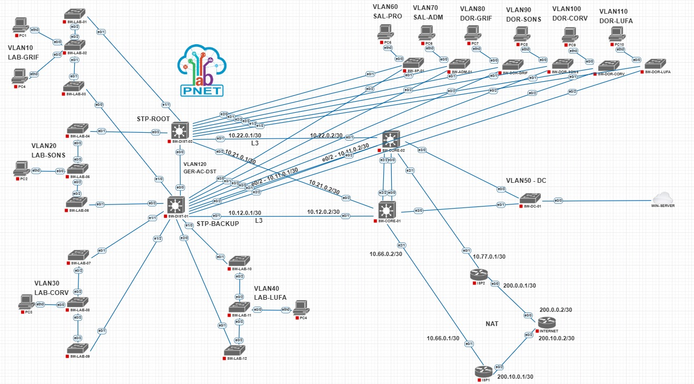

------------------------------------------------------------------------------------------------------------------------------------------------------------------------------------

# Projeto de Rede Hierárquica Cisco — CCNA

Laboratório prático de infraestrutura de redes desenvolvido em ambiente PNETLab,
integrando tecnologias Cisco com serviços de infraestrutura em Windows Server.

O projeto foi baseado no laboratório original desenvolvido por Gustavo Kalau
durante a 3ª Semana Mão na Massa CCNA, que serviu como mentor e referência
durante o desenvolvimento da infraestrutura.

A arquitetura e os principais conceitos apresentados no projeto original foram
utilizados como base, porém a implementação deste repositório foi reproduzida,
adaptada e validada em ambiente próprio, incluindo alterações na topologia,
endereçamento de gerenciamento, Native VLAN, integração com Windows Server,
organização das configurações e troubleshooting realizado durante a construção
do laboratório.

O cenário simula a rede de uma instituição de ensino fictícia, organizada em uma
arquitetura hierárquica composta pelas camadas de Acesso, Distribuição e Core,
além de Data Center e conectividade com uma rede externa.

A implementação envolve switching, roteamento dinâmico, redundância, segmentação
por VLANs, serviços centralizados de rede e validação dos principais componentes
da infraestrutura.


------------------------------------------------------------------------------------------------------------------------------------------------------------------------------------


## 📌 Objetivos

Este projeto foi desenvolvido com o objetivo de aplicar, em um ambiente prático,
conceitos de switching, routing, redundância e serviços de infraestrutura
estudados ao longo da preparação para o CCNA.

A proposta foi construir e validar uma rede hierárquica simulando o ambiente de
uma instituição de ensino fictícia (Hogwarts), passando desde a segmentação da rede até o roteamento
entre os diferentes setores e a saída para a Internet.

Durante a implementação, foram trabalhados conceitos como:

- Segmentação da rede através de VLANs;
- Configuração de portas Access e Trunks 802.1Q;
- Roteamento Inter-VLAN através de switches Layer 3;
- Redundância de gateway utilizando HSRP;
- Prevenção de loops e definição de caminhos através do STP;
- Agregação de enlaces utilizando EtherChannel com LACP;
- Roteamento dinâmico utilizando OSPF;
- Centralização dos serviços de DHCP e DNS;
- DHCP Relay entre as VLANs e o servidor central;
- Integração de um Windows Server ao ambiente;
- NAT/PAT e conectividade com a Internet através de dois roteadores de borda;
- Troubleshooting e validação dos principais serviços da infraestrutura.


------------------------------------------------------------------------------------------------------------------------------------------------------------------------------------


## 🗂️ Estrutura do Repositório

A organização do repositório foi separada por função para facilitar a navegação
entre configurações, documentação e evidências do laboratório.

```text
ccna-hierarchical-network-lab/
│
├── README.md
├── LICENSE
│
├── topology/
│   ├── topology-final.png
│   └── pnetlab/
│       └── lab-export.unl
│
├── configs/
│   ├── access/
│   ├── distribution/
│   ├── core/
│   ├── datacenter/
│   └── edge/
│
├── windows-server/
│   ├── server-manager-overview.png
│   ├── server-manager-overview-2.png
│   │
│   ├── network/
│   │   └── ipv4-config.png
│   │
│   ├── ad-ds/
│   │   └── domain-servidordc-local.png
│   │
│   ├── dhcp/
│   │   └── dhcp-scopes.png
│   │
│   └── dns/
│       └── dns-zone.png
│
├── docs/
│   ├── addressing.md
│   ├── troubleshooting.md
│   └── validation.md
│
└── evidence/
    ├── ospf/
    ├── hsrp/
    ├── stp/
    ├── etherchannel/
    ├── dhcp/
    ├── dns/
    └── nat/
	
```
	
------------------------------------------------------------------------------------------------------------------------------------------------------------------------------------


## 🏗️ Arquitetura

A infraestrutura foi construída utilizando um modelo hierárquico de rede,
separando as funções dos equipamentos entre as camadas de Acesso,
Distribuição e Core.

Além dessas camadas, o ambiente possui uma estrutura dedicada ao Data Center
e uma camada de borda responsável pela comunicação com a rede externa.

### Access Layer

A camada de acesso é responsável pela conexão dos dispositivos finais e pela
segmentação dos diferentes setores da instituição.

Os switches dessa camada atendem os laboratórios, sala dos professores,
área administrativa, dormitórios.

Cada grupo de usuários foi separado em uma VLAN própria, enquanto uma VLAN
específica foi utilizada para o gerenciamento dos switches.

### Distribution Layer

A camada de distribuição é composta pelos switches:

- SW-DIST-01
- SW-DIST-02

Esses equipamentos concentram os switches de acesso e realizam o roteamento
das VLANs de usuários através de interfaces SVI.

Também são responsáveis por funções como:

- HSRP para redundância de gateway;
- STP para controle dos caminhos Layer 2;
- DHCP Relay;
- OSPF para comunicação com a camada Core.

### Core Layer

A camada Core é composta pelos switches:

- SW-CORE-01
- SW-CORE-02

Os switches Core interligam a camada de distribuição, o Data Center e os
roteadores responsáveis pela saída da rede.

Entre os dois equipamentos foi configurado um EtherChannel utilizando LACP,
fornecendo redundância e agregação dos enlaces entre os switches.

A comunicação entre Core e Distribuição é realizada através de enlaces Layer 3
ponto a ponto.

### Data Center

O Data Center utiliza a VLAN 50 e possui conexão com os dois switches Core.

O "SW-DC-01" conecta o Windows Server utilizado no laboratório, responsável
pelos serviços centralizados de:

- Active Directory Domain Services;
- DNS;
- DHCP.

### Edge / Internet

A borda da rede possui dois roteadores, "ISP1" e "ISP2", conectados aos
switches Core.

Esses equipamentos realizam NAT/PAT e possuem rotas default apontando para
o roteador "INTERNET", utilizado para representar uma rede externa no
laboratório.

O endereço "8.8.8.8/32", configurado em uma interface Loopback do roteador
"INTERNET", é utilizado como destino para os testes de conectividade externa.


------------------------------------------------------------------------------------------------------------------------------------------------------------------------------------


## 🌐 Topologia

A topologia foi construída em ambiente **PNETLab**, seguindo uma arquitetura
hierárquica e utilizando caminhos redundantes entre as principais camadas da rede.

A infraestrutura é composta por switches de Acesso, dois switches de Distribuição,
dois switches Core, uma estrutura dedicada ao Data Center e dois roteadores de
borda responsáveis pela saída para a rede externa.



De forma resumida, o fluxo da infraestrutura pode ser representado como:

Access Layer  
↓  
Distribution Layer  
↓  
Core Layer  
↓  
ISP1 / ISP2  
↓  
Internet

O Data Center é conectado aos dois switches Core, permitindo comunicação com
o restante da infraestrutura através da VLAN 50.

Os enlaces entre Distribuição e Core operam em Layer 3 utilizando redes ponto
a ponto /30, enquanto os enlaces necessários ao transporte de VLANs operam como
trunks IEEE 802.1Q.

A redundância da infraestrutura é fornecida através da combinação de diferentes
tecnologias, como HSRP, STP, EtherChannel e OSPF.


------------------------------------------------------------------------------------------------------------------------------------------------------------------------------------


## 🧩 Segmentação por VLANs

A rede foi segmentada de acordo com os diferentes setores e grupos de usuários
da instituição.

Cada segmento possui uma VLAN e uma sub-rede IPv4 própria, reduzindo os domínios
de broadcast e permitindo que o roteamento entre os setores seja controlado
pelos switches Layer 3.

|VLAN |    Nome     |      Rede        |                    Finalidade                       |
|---: |     ---     |      ---         |                        ---                          |
| 10  | LAB-GRIF    | 192.168.10.0/24  | Laboratórios GRIF                                   |
| 20  | LAB-SONS    | 192.168.20.0/24  | Laboratórios SONS                                   |
| 30  | LAB-CORV    | 192.168.30.0/24  | Laboratórios CORV                                   |
| 40  | LAB-LUFA    | 192.168.40.0/24  | Laboratórios LUFA                                   |
| 50  | DC          | 192.168.50.0/24  | Data Center                                         |
| 60  | SAL-PRO     | 192.168.60.0/24  | Sala dos Professores                                |
| 70  | SAL-ADM     | 192.168.70.0/24  | Área Administrativa                                 |
| 80  | DOR-GRIF    | 192.168.80.0/24  | Dormitório GRIF                                     |
| 90  | DOR-SONS    | 192.168.90.0/24  | Dormitório SONS                                     |
| 100 | DOR-CORV    | 192.168.100.0/24 | Dormitório CORV                                     |
| 110 | DOR-LUFA    | 192.168.110.0/24 | Dormitório LUFA                                     |
| 120 | GER-AC-DST  | 172.16.120.0/24  | Gerenciamento dos switches de Acesso e Distribuição |
| 130 | GER-DC-CORE | 172.16.130.0/24  | Gerenciamento dos switches Core e Data Center       |
| 333 | Native      |        —         | Native VLAN dedicada aos enlaces trunk              |

### VLANs de Gerenciamento

Foram utilizadas duas redes específicas para gerenciamento da infraestrutura:

- **VLAN 120 — GER-AC-DST:** destinada aos switches de Acesso e Distribuição;
- **VLAN 130 — GER-DC-CORE:** destinada aos equipamentos do Core e Data Center.

Essa separação mantém o tráfego de gerenciamento independente das redes
utilizadas pelos usuários.

### Native VLAN

A **VLAN 333** foi criada especificamente para atuar como Native VLAN nos enlaces trunk.

Ela não possui SVI ou endereçamento IP destinado a usuários e não é utilizada
como VLAN de produção.


------------------------------------------------------------------------------------------------------------------------------------------------------------------------------------


## 🔗 Enlaces Layer 3

A comunicação entre a camada de Distribuição e a camada Core foi implementada
através de enlaces Layer 3 ponto a ponto.

As interfaces utilizadas nesses enlaces foram convertidas para portas roteadas,
permitindo a formação de adjacências OSPF diretamente entre os equipamentos.

Foram utilizadas redes "/30", fornecendo dois endereços IPv4 utilizáveis para
cada conexão ponto a ponto.

|   Origem   |   Destino  |    Rede       |  IP Origem | IP Destino |
|     ---    |     ---    |      ---      |    ---     |    ---     |
| SW-DIST-01 | SW-CORE-01 | 10.12.0.0/30  | 10.12.0.1  | 10.12.0.2  |
| SW-DIST-01 | SW-CORE-02 | 10.11.0.0/30  | 10.11.0.1  | 10.11.0.2  |
| SW-DIST-02 | SW-CORE-01 | 10.21.0.0/30  | 10.21.0.1  | 10.21.0.2  |
| SW-DIST-02 | SW-CORE-02 | 10.22.0.0/30  | 10.22.0.1  | 10.22.0.2  |
| SW-CORE-01 |    ISP1    | 10.66.0.0/30  | 10.66.0.2  | 10.66.0.1  |
| SW-CORE-02 |    ISP2    | 10.77.0.0/30  | 10.77.0.2  | 10.77.0.1  |
|   ISP1     |  INTERNET  | 200.10.0.0/30 | 200.10.0.1 | 200.10.0.2 |
|   ISP2     |  INTERNET  | 200.0.0.0/30  | 200.0.0.1  | 200.0.0.2  |

Os quatro enlaces entre **Distribuição e Core** participam do domínio OSPF e
fornecem caminhos redundantes para o roteamento interno.

Os enlaces "10.66.0.0/30" e "10.77.0.0/30" conectam os switches Core aos
roteadores de borda, enquanto as redes "200.10.0.0/30" e "200.0.0.0/30"
representam as conexões externas dos ISPs com o roteador "INTERNET".


------------------------------------------------------------------------------------------------------------------------------------------------------------------------------------


## 🔄 OSPF

O roteamento dinâmico da infraestrutura foi implementado utilizando OSPF,
com o processo 10 operando integralmente na Área 0.

O protocolo é responsável pela troca de rotas entre os switches de Distribuição,
Core e os roteadores de borda.

As adjacências OSPF são formadas principalmente através dos enlaces Layer 3
ponto a ponto existentes entre essas camadas.

### Router IDs

| Equipamento | Router ID |
|     ---     |    ---    |
|  SW-DIST-01 |  1.1.1.1  |
|  SW-DIST-02 |  1.1.2.2  |
|  SW-CORE-01 |  3.3.3.3  |
|  SW-CORE-02 |  3.3.4.4  |
|     ISP1    |  4.4.4.4  |
|     ISP2    |  4.4.5.5  |

Nos switches internos foi utilizada a estratégia de manter as interfaces
passivas por padrão, permitindo formação de vizinhança apenas nos enlaces
destinados ao roteamento entre equipamentos.

Os roteadores ISP1 e ISP2 possuem rotas default apontando para o roteador
INTERNET e anunciam essa saída para o domínio OSPF.

Dessa forma, os equipamentos internos aprendem dinamicamente os caminhos
necessários para alcançar a rede externa.


------------------------------------------------------------------------------------------------------------------------------------------------------------------------------------


## 🛡️ HSRP

O HSRP foi utilizado para fornecer redundância de gateway às redes atendidas
pelos switches Layer 3.

Em vez de os hosts utilizarem diretamente o endereço IP de um dos switches,
é utilizado um endereço IP virtual compartilhado pelos dois equipamentos.

Nas VLANs atendidas pela camada de Distribuição, o padrão de endereçamento é:

- Gateway virtual: 192.168.X.1
- SW-DIST-01: 192.168.X.2
- SW-DIST-02: 192.168.X.3

O SW-DIST-01 foi configurado com maior prioridade e "preempt", atuando como
equipamento preferencial para as VLANs de usuários.

O SW-DIST-02 permanece disponível para assumir a função caso o equipamento
principal fique indisponível.

Exemplo para a VLAN 10:

|     Função      |   Endereço   |
|       ---       |      ---     |
| HSRP Virtual IP | 192.168.10.1 |
|   SW-DIST-01    | 192.168.10.2 |
|   SW-DIST-02    | 192.168.10.3 |

O mesmo conceito foi aplicado à VLAN 50 do Data Center através dos switches Core:

|    Função       |   Endereço   |
|       ---       |      ---     |
| HSRP Virtual IP | 192.168.50.1 |
|   SW-CORE-01    | 192.168.50.2 |
|   SW-CORE-02    | 192.168.50.3 |


------------------------------------------------------------------------------------------------------------------------------------------------------------------------------------


## 🌳 Spanning Tree Protocol

O Spanning Tree Protocol foi utilizado para impedir loops Layer 2 e definir
de forma previsível os caminhos preferenciais da infraestrutura.

Na camada de Distribuição:

- SW-DIST-01 possui prioridade STP 0;
- SW-DIST-02 possui prioridade STP 4096.

Na camada Core:

- SW-CORE-01 possui prioridade STP 0;
- SW-CORE-02 possui prioridade STP 4096.

Com essa configuração, os equipamentos principais possuem preferência na
eleição de Root Bridge, enquanto os equipamentos secundários permanecem
como alternativa em caso de falha.

O STP trabalha em conjunto com a redundância física existente na topologia,
evitando que os múltiplos caminhos Layer 2 provoquem loops na rede.


------------------------------------------------------------------------------------------------------------------------------------------------------------------------------------


## 🔀 EtherChannel

Os switches SW-CORE-01 e SW-CORE-02 possuem dois enlaces físicos agregados
em um único enlace lógico através de EtherChannel.

Foi utilizado o protocolo LACP com o Port-Channel 1.

O Port-Channel opera como trunk entre os dois switches Core e transporta
as VLANs necessárias à comunicação do Data Center e da infraestrutura de
gerenciamento.

A agregação dos enlaces permite que as duas conexões físicas sejam tratadas
como uma única interface lógica, além de oferecer redundância caso um dos
enlaces físicos fique indisponível.

Estrutura utilizada:

```text

SW-CORE-01
    |
    | Ethernet0/0
    | Ethernet2/2
    |
 Port-Channel 1
    |
    | Ethernet0/0
    | Ethernet2/2
    |
SW-CORE-02

```

------------------------------------------------------------------------------------------------------------------------------------------------------------------------------------


## 🖥️ Data Center

O Data Center utiliza a VLAN 50, correspondente à rede:

192.168.50.0/24

O switch SW-DC-01 é responsável pela conexão do servidor com a infraestrutura
e possui uplinks para os dois switches Core.

O servidor está conectado através de uma porta Access pertencente à VLAN 50,
enquanto os enlaces com os switches Core operam como trunks.

A redundância do gateway da VLAN 50 é fornecida através de HSRP:

|     Função      |    Endereço   |
|      ---        |      ---      |
| Gateway Virtual | 192.168.50.1  |
|   SW-CORE-01    | 192.168.50.2  |
|   SW-CORE-02    | 192.168.50.3  |
| Windows Server  | 192.168.50.10 |


------------------------------------------------------------------------------------------------------------------------------------------------------------------------------------


## 🪟 Windows Server e Serviços de Infraestrutura

O laboratório possui um Windows Server integrado à rede através da VLAN 50.

O servidor utiliza o endereço:

192.168.50.10

Além de atuar como servidor central do ambiente, foram instaladas as funções
necessárias para fornecer serviços de infraestrutura às demais redes.

### Active Directory Domain Services

Foi configurado o Active Directory Domain Services para criação da estrutura
de domínio utilizada no laboratório.

Domínio utilizado:

servidordc.local

### DHCP

O serviço DHCP foi centralizado no Windows Server.

Como o servidor está localizado na VLAN 50, os clientes pertencentes às demais
VLANs não conseguem enviar solicitações DHCP diretamente através dos limites
de broadcast.

Para permitir essa comunicação, foi utilizado DHCP Relay nas interfaces SVI
responsáveis pelas redes de usuários.

As solicitações são encaminhadas para:

192.168.50.10

Dessa forma, um único servidor DHCP consegue fornecer endereçamento para
múltiplas VLANs.

### DNS

O serviço DNS também foi configurado no Windows Server, fornecendo resolução
de nomes para o ambiente.

A integração entre DNS e Active Directory permite que os recursos do domínio
sejam localizados através de nomes em vez de depender exclusivamente de
endereços IP.


------------------------------------------------------------------------------------------------------------------------------------------------------------------------------------


## 🌍 Acesso à Internet e NAT/PAT

A saída da infraestrutura para a rede externa é realizada através de dois
roteadores de borda:

- ISP1
- ISP2

Cada roteador possui uma conexão com um dos switches Core e uma conexão
externa com o roteador INTERNET.

### ISP1

Rede interna: 10.66.0.0/30

Rede externa: 200.10.0.0/30

### ISP2

Rede interna: 10.77.0.0/30

Rede externa: 200.0.0.0/30

Os dois roteadores possuem uma rota default apontando para o roteador INTERNET.

A tradução dos endereços privados foi implementada utilizando NAT/PAT.

A ACL utilizada para identificar as redes que podem ser traduzidas contempla:

192.168.0.0/16

Com o uso de overload, múltiplos dispositivos internos conseguem utilizar o
endereço IPv4 da interface externa do respectivo roteador para acessar a
rede simulada como Internet.

### Internet Simulada

O roteador INTERNET representa a rede externa do laboratório.

Foi configurada uma interface Loopback utilizando:

8.8.8.8/32

Esse endereço é utilizado como destino para validar a conectividade fim a fim,
incluindo:

VLAN → Gateway → OSPF → Core → ISP → NAT/PAT → Internet


------------------------------------------------------------------------------------------------------------------------------------------------------------------------------------


## 🧪 Testes e Validações

Após a implementação, foram realizados testes para validar o funcionamento
dos principais componentes da infraestrutura.

### Switching

Foram validados:

- VLANs;
- Portas Access;
- Enlaces trunk;
- Native VLAN;
- STP;
- EtherChannel;
- Port-Channel.

### Routing

Foram verificados:

- Roteamento Inter-VLAN;
- Interfaces SVI;
- Enlaces Layer 3;
- Adjacências OSPF;
- Tabelas de roteamento;
- Propagação da rota default.

### Redundância

Foram realizados testes envolvendo:

- Estados Active e Standby do HSRP;
- Alteração do equipamento ativo;
- Redundância entre Distribuição e Core;
- Redundância dos enlaces entre os switches Core.

### Serviços

Foram validados:

- Distribuição de endereços via DHCP;
- Funcionamento do DHCP Relay;
- Resolução de nomes através do DNS;
- Comunicação entre diferentes VLANs;
- Comunicação com o Windows Server.

### Internet

Foram verificados:

- Rota default;
- Traduções NAT;
- Estatísticas do NAT;
- Comunicação com o endereço 8.8.8.8;
- Caminho completo entre as redes internas e a rede externa.


------------------------------------------------------------------------------------------------------------------------------------------------------------------------------------


## 🔧 Troubleshooting

Durante a construção do laboratório ocorreram diferentes problemas que exigiram
análise e troubleshooting da infraestrutura.

Esses cenários fizeram parte do processo de desenvolvimento e foram utilizados
para compreender melhor o funcionamento dos protocolos e tecnologias utilizadas.

Entre os principais problemas investigados estiveram:

### HSRP Split-Active

Durante os testes foi identificado um cenário em que dois equipamentos
assumiram simultaneamente o estado Active.

A investigação envolveu a validação da comunicação Layer 2, das VLANs e dos
enlaces existentes entre os switches de distribuição.

### OSPF

Foram investigados problemas relacionados à formação e estabilidade das
adjacências OSPF, além da configuração das interfaces participantes do processo
de roteamento.

### Rota Default

Durante a configuração da saída para Internet foi identificado um next-hop
incorreto em uma rota default.

Após a correção, o encaminhamento para a rede externa voltou a funcionar
normalmente.

### NAT/PAT

Em um dos testes, a falha de comunicação inicialmente indicava um possível
problema de NAT.

A análise das traduções mostrou que o NAT estava funcionando corretamente.

O problema estava no roteador INTERNET, onde a interface Loopback utilizada
como destino de teste estava sem o endereço 8.8.8.8/32.

### PNETLab e VMware

Também foram encontrados problemas relacionados à integração entre o ambiente
virtual e o laboratório, incluindo:

- Interfaces de rede da VM;
- Bridges do PNETLab;
- Configuração das redes VMware;
- Conflitos de endereçamento;
- Comunicação entre o host, as máquinas virtuais e a topologia.

Os detalhes desses cenários poderão ser documentados separadamente em:

docs/troubleshooting.md


------------------------------------------------------------------------------------------------------------------------------------------------------------------------------------

## 🔄 Adaptações em Relação ao Projeto-Base

O laboratório foi baseado no projeto apresentado por Gustavo Kalau durante a
3ª Semana Mão na Massa CCNA, sendo reproduzido e também adaptado em ambiente próprio.

Entre as principais alterações estão a utilização do PNETLab, integração com
VMware e Windows Server, alteração das redes de gerenciamento, utilização da
VLAN 333 como Native VLAN e documentação dos testes e troubleshooting realizados.

------------------------------------------------------------------------------------------

## 📚 Créditos

Projeto baseado no laboratório desenvolvido por Gustavo Kalau para a
3ª Semana Mão na Massa CCNA, que serviu como mentor e principal referência
durante o desenvolvimento.

------------------------------------------------------------------------------------------

## ⚠️ Ambiente de Laboratório

Projeto desenvolvido exclusivamente para fins de estudo em ambiente simulado.

Algumas configurações, incluindo credenciais como "class", foram mantidas de
forma simplificada e não representam recomendações para ambientes de produção.

------------------------------------------------------------------------------------------

## 👤 Autor

Cleison Macanosso Rodrigues

Projeto desenvolvido para prática de Redes de Computadores, infraestrutura,
Windows Server e tecnologias abordadas durante a preparação para o CCNA.
	
------------------------------------------------------------------------------------------------------------------------------------------------------------------------------------
